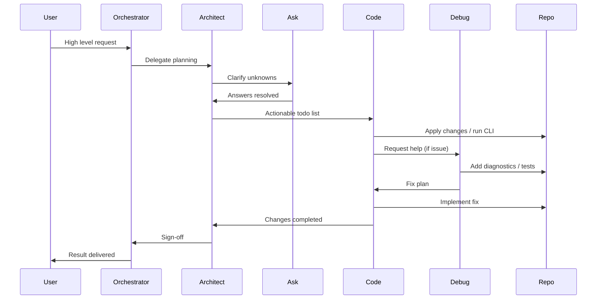
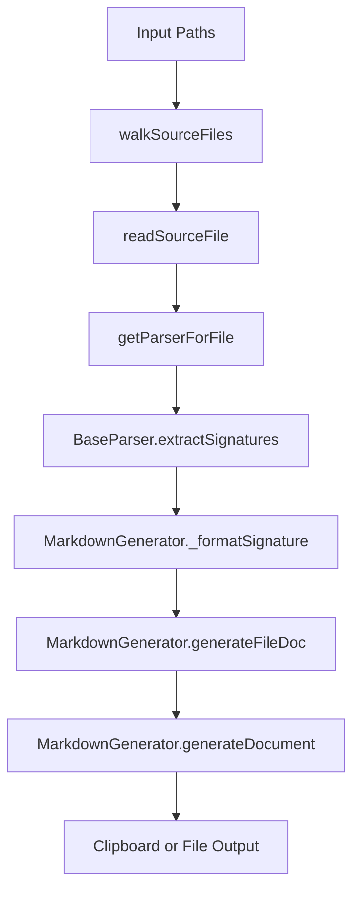

# AGENTS Operating Manual

> Authoritative cross‑agent protocol for this repository.  
> Audience: all autonomous / semi‑autonomous agents (Architect, Code, Ask, Debug, Orchestrator, Code (Advanced)).  
> Complements (not duplicates) core project overview in [README.md](README.md).

---

## 1. Purpose

Provide a single source of truth for:
- Roles & boundaries
- Tool usage & constraints
- Handoff sequencing
- Error recovery patterns
- Quality gates & acceptance criteria
- Extensibility (new parsers, docs evolution)

If conflict arises: this file → repository source (e.g. [src/core/mdGenerator.ts](src/core/mdGenerator.ts:1)) → runtime behavior → README.

---

## 2. Repository Execution Pipeline (High Level)

Traversal → Parsing → Normalization → Assembly → Output (file or clipboard)

Key entry points:
- CLI bootstrap: [src/cli/index.ts](src/cli/index.ts:1)
  - Parser registration lines: [MarkdownGenerator.registerParser() calls](src/cli/index.ts:20)
- Traversal: [walkSourceFiles()](src/core/fileWalker.ts:14)
- File read: [readSourceFile()](src/core/fileWalker.ts:45)
- Parser abstraction: [BaseParser](src/core/processors/baseParser.ts:7)
  - Signature extraction: [BaseParser.extractSignatures()](src/core/processors/baseParser.ts:14)
- Markdown assembly: [MarkdownGenerator](src/core/mdGenerator.ts:69)
  - Parser lookup: [MarkdownGenerator.getParserForFile()](src/core/mdGenerator.ts:100)
  - Document generation: [MarkdownGenerator.generateDocument()](src/core/mdGenerator.ts:110)
  - File section builder: [MarkdownGenerator.generateFileDoc()](src/core/mdGenerator.ts:132)
  - Signature formatting: [MarkdownGenerator._formatSignature()](src/core/mdGenerator.ts:152)

Language parser implementations (linked by file only):
- [TypeScriptParser](src/core/processors/tsParser.ts)
- [GoParser](src/core/processors/goParser.ts)
- [JavaParser](src/core/processors/javaParser.ts)
- [PythonParser](src/core/processors/pyParser.ts)
- [RustParser](src/core/processors/rustParser.ts)
- [PhpParser](src/core/processors/phpParser.ts)

---

## 3. Agent Role Definitions

| Agent | Primary Objectives | Must Not Do (Boundary Violations) |
|-------|--------------------|-----------------------------------|
| Architect | Convert user intent → executable todo sequence; specify explicit file/function targets; ensure linking & formatting compliance | Perform code mutations outside .md scope; skip required semantic search before planning |
| Code | Implement modifications (docs & source); follow diffs precisely; maintain deterministic formatting | Alter scope without Architect approval; perform large rewrites without justification |
| Code (Advanced) | Handle complex refactors (parser heuristics, multi‑file interdependencies, performance-sensitive routines) | Execute trivial edits better suited for Code |
| Ask | Resolve ambiguity efficiently; enumerate assumptions & required clarifications | Proceed when critical parameters still unknown |
| Debug | Isolate root cause; add minimal instrumentation; propose targeted fix + test deltas | Implement unrelated optimizations during incident analysis |
| Orchestrator | Sequence multi‑phase missions; enforce state transitions; ensure todos updated | Bypass role-specific quality gates |
| (Implicit) QA Gate | Validate links, diagrams, determinism, test coverage deltas | Accept incomplete or ambiguously specified outputs |

---

## 4. Tooling & Protocol Constraints

Mandatory sequencing rules:
1. New code area exploration → semantic search first (codebase_search).
2. Then optionally narrow via regex (search_files) or structural introspection (list_code_definition_names).
3. Read exact file segments (read_file) before surgical edits.
4. Editing hierarchy:
   - apply_diff → for targeted replacements
   - insert_content → append/prepend only
   - search_and_replace → pattern-based multi-location
   - write_to_file → net-new file OR full rewrite (must include entire content)
5. One tool invocation per message; wait for explicit success confirmation before proceeding.

Linking rule (REQUIRED): Every filename or symbol reference must be clickable as:
- File: [src/core/fileWalker.ts](src/core/fileWalker.ts)
- Symbol: [walkSourceFiles()](src/core/fileWalker.ts:14)

Line number REQUIRED for code constructs; optional for plain files.

---

## 5. Core Workflows

### 5.1 Generate Context (Default User Request)
1. Architect captures scope (paths, flags).
2. Code runs CLI: `ctx <paths...> [-f] [-v] [--output FILE]`.
3. Output validated: headings, separators, code fences match [MarkdownGenerator constants](src/core/mdGenerator.ts:20).
4. Ask intervenes if ambiguous paths or missing write target.
5. Architect updates planning artifacts (todo list / docs).
6. Delivery: file link + summary (counts mirror CLI summary fields in [src/cli/index.ts](src/cli/index.ts:189)).

### 5.2 Add New Language Parser
1. Architect creates acceptance criteria (extensions, edge constructs).
2. Code scaffolds parser extending [BaseParser](src/core/processors/baseParser.ts:7).
3. Register parser in CLI bootstrap (see existing calls at [src/cli/index.ts](src/cli/index.ts:20)).
4. Add tests (use patterns from existing under [src/tests](src/tests/tsParser.test.ts)).
5. Run `bun test`; CI summary must show new signature cases pass.
6. Architect amends documentation (README + AGENTS if new patterns).
7. QA enforces deterministic formatting (no unstable ordering).

### 5.3 Fix Incorrect Signature Extraction
1. Debug reproduces using minimal snippet.
2. Adds failing test referencing parser file + construct.
3. Code patches parser; re-runs tests.
4. Debug confirms elimination of regression; scans for collateral impact.
5. Architect updates change notes if semantics shift.

### 5.4 Update Markdown Output Format
1. Architect drafts impact analysis (consumer expectations, backward compatibility).
2. Code applies change centralizing modifications to [MarkdownGenerator](src/core/mdGenerator.ts:69).
3. Add regression test or golden snapshot if needed.
4. QA: ensure no broken downstream references (docs, examples, README).

---

## 6. Handoff Matrix

| From | To | Trigger | Required Artifacts |
|------|----|---------|--------------------|
| Orchestrator | Architect | New mission / complex multi-step | User intent, constraints |
| Architect | Code | Plan finalized | Todo list with explicit file/symbol refs |
| Code | Debug | Unexpected runtime/parsing anomaly | Reproducer path(s), observed vs expected |
| Debug | Code | Fix strategy ready | Minimal diff outline, test additions |
| Code | Architect | Implementation complete | Diff summary, impacted components |
| Architect | Orchestrator | Sign-off / new phase | Updated roadmap / backlog |
| Ask | Architect | Clarification resolved | Resolved assumptions list |

---

## 7. Error Handling & Recovery Patterns

| Scenario | Detection | Path to Resolution |
|----------|-----------|--------------------|
| Unknown file extension | Parser lookup returns undefined (see [MarkdownGenerator.getParserForFile()](src/core/mdGenerator.ts:100)) | Architect decides add parser vs skip; Code implements if add |
| Empty output section | No signatures + no full source flag | Validate file actually has functions; potential parser gap |
| Broken link in docs | Non-clickable reference or missing line for symbol | Code amends to conform to linking rule |
| CLI abort (invalid path) | Warning lines in action block, see path resolution area | Ask clarifies correct path set; rerun |
| Mis-normalized signature | Test mismatch vs expected formatting | Debug isolates; Code adjusts parser or formatter |
| Non-deterministic ordering | Diff noise across runs | Enforce stable traversal order (check [walkSourceFiles()](src/core/fileWalker.ts:14)) |

Rollback Guideline: Retain pre-change doc or code snapshot; re-run `bun test` to validate no regression.

---

## 8. Quality Gates & Checklists

### 8.1 Universal
- All symbol references clickable: e.g. [MarkdownGenerator.generateDocument()](src/core/mdGenerator.ts:110).
- No unreferenced “magic” behavior; cite source lines.
- Deterministic formatting: headings, separators `---`, code fences produced via constants at [src/core/mdGenerator.ts](src/core/mdGenerator.ts:1).

### 8.2 Parser Addition
- Extensions array declared (unique; collision warning possible at [MarkdownGenerator.registerParser()](src/core/mdGenerator.ts:77)).
- Edge cases enumerated in test names.
- Return types extracted or explicitly undefined (helper pattern: implement `extractReturnType` analog if needed).

### 8.3 Documentation Change
- README modifications consistent with AGENTS manual.
- No stale CLI flag descriptions (cross-check lines [src/cli/index.ts](src/cli/index.ts:35)).

### 8.4 Bug Fix
- Reproduction test added first (red → green).
- Only minimal necessary diff in parser logic.
- No accidental broader formatting changes.

---

## 9. Naming & Formatting Conventions

| Aspect | Rule |
|--------|------|
| Function signature format | `[ClassName] name(param: Type): ReturnType` or `function name(param: Type): ReturnType` |
| Async functions | Prefix `async` retained in signature (see [MarkdownGenerator._formatSignature()](src/core/mdGenerator.ts:152)) |
| Section headings | `## <relative/file/path>` |
| Separator | Standalone `---` line after each file block |
| Code fence wrapper | Custom `<context type="lang">` ... `</context>` (see constants block [src/core/mdGenerator.ts](src/core/mdGenerator.ts:20)) |

---

## 10. Extensibility Guidance (Parsers)

Minimum methods (see [BaseParser](src/core/processors/baseParser.ts:7)):
- [BaseParser.extractSignatures()](src/core/processors/baseParser.ts:14) orchestrates transform pipeline.
- Language-specific overrides:
  - `extractFunctionMatches`
  - `parseFunctionSignature`
  - `parseParameters`
  - `extractReturnType`
  - `getExtensions`
  - `getMarkdownLanguageId`

Register once at startup (lines [src/cli/index.ts](src/cli/index.ts:20)). Avoid side effects inside parser constructors other than lightweight state initialization.

---

## 11. Example Interaction Scenarios

### 11.1 Adding Rust Edge Case Support
1. Architect: adds todo referencing [src/core/processors/rustParser.ts](src/core/processors/rustParser.ts).
2. Code: writes failing test under [src/tests/rustParser.test.ts](src/tests/rustParser.test.ts).
3. Debug (if needed): clarifies ambiguity in multi-return parsing.
4. Code: patches logic; verifies green tests.
5. Architect: updates normalization examples if changed semantics.

### 11.2 Large Multi-Language Report Request
1. Ask: clarifies directory scope (e.g., `./src ./examples`).
2. Architect: enumerates plan.
3. Code: runs CLI, outputs `CODE_CONTEXT.md`.
4. QA: validates clickable representative sample.
5. Orchestrator: closes task.

---

## 12. Mermaid Diagrams

### 12.1 Cross Agent Sequence

### 12.2 Processing Pipeline

---

## 13. Evolution Rules

- Any change altering output format MUST:
  - Update README output example block lines (see format example near [README.md](README.md)).
  - Provide migration note (top of AGENTS.md if breaking).
  - Add golden snapshot test (strategy: future improvement).

- Deprecating a flag: mark in CLI description (see `--input` deprecation text lines [src/cli/index.ts](src/cli/index.ts:37)) and note rationale here.

---

## 14. Acceptance Criteria (Definition of Done)

| Category | Must Hold |
|----------|-----------|
| Referential Integrity | Every symbol referenced clickable with correct line |
| Determinism | Re-running generation yields identical output (modulo file system changes) |
| Clarity | No ambiguous pronouns (replace “it” with explicit component names) |
| Traceability | Each non-trivial rule references source of truth line |
| Test Hygiene | Parser or logic changes accompanied by test deltas when behavior changes |
| Extensibility | Adding new parser requires zero modifications outside its file + registration line |

---

## 15. Link Legend

| Reference Style | Example |
|-----------------|---------|
| File | [src/core/mdGenerator.ts](src/core/mdGenerator.ts) |
| Symbol | [MarkdownGenerator.generateDocument()](src/core/mdGenerator.ts:110) |
| Parser Base | [BaseParser](src/core/processors/baseParser.ts:7) |
| Function | [walkSourceFiles()](src/core/fileWalker.ts:14) |

---

## 16. Open Improvement Opportunities

| Idea | Rationale |
|------|-----------|
| Snapshot tests for markdown output | Guard against accidental formatting regressions |
| Parser plugin discovery | Decouple registration from CLI (align with roadmap) |
| Performance telemetry hooks | Empirical benchmarking for large repos |
| Error classification taxonomy | Structured recovery suggestions per category |

---

## 17. Operational Heuristics

- Prefer minimal diff patches over broad refactors.
- Keep parser regex/state machines shallow; align with “good enough” philosophy (see README Parsing Philosophy section).
- Avoid introducing AST library dependencies without Architect approval.
- Always cite the canonical constant or function line when relying on formatting contracts.

---

## 18. Escalation Path

If an agent cannot proceed due to:
- Ambiguity unresolved after one Ask cycle
- Non-deterministic output origin unclear
- Parser collision (extension already owned)

Then:
1. Document blocking condition.
2. Provide candidate resolution strategies.
3. Handoff back to Architect with explicit decision request.

---

## 19. Compliance Self-Check (Pre-Handoff)

- [ ] All new symbol references clickable & accurate
- [ ] No unverified assumptions (each resolved via Ask or code inspection)
- [ ] Output format unchanged OR explicitly documented
- [ ] Tests pass (if code touched)
- [ ] Todos updated reflecting actual state
- [ ] Mermaid diagrams free of double quotes or parentheses inside square brackets

---

## 20. Final Notes

This document is itself version controlled; any structural or semantic change must:
1. Justify necessity in PR description.
2. Cross-check references to line numbers after upstream file edits.
3. Incrementally adapt rather than rewrite wholesale to preserve auditability.

End of AGENTS Operating Manual.